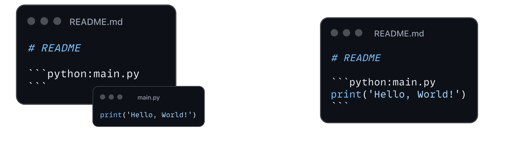

# code-embedder



Keep your code snippets in README files up-to-date with Code-Embedder.

## Description

This action looks for the following sections in the readme file:
````md
 ```language:path/to/script
 ```
````
This action will update the code snippets with the content of the script located at `path/to/script` and push the changes to the repository.

### Example

You will add the code block sections with path to the scripts in the following format:
````md
# README

This is a readme.

```python:main.py
```
````
And once the worklow runs, the code block sections will be filled with the content of the script located at `main.py` and updated in the readme file.

````md
# README

This is a readme.

```python:main.py
print("Embedding successful")
```
````
Once the content of the script located at `main.py` changes, the code block section will be updated in the readme file with the next workflow run.


## Setup
To use this action, you need to configure a yaml workflow file in `.github/workflows` folder (e.g. `.github/workflows/code-embedder.yaml`) with the following content:

```yaml
name: Code Embedder

on: pull_request

jobs:
  code_embedder:
    name: "Code embedder"
    runs-on: ubuntu-latest
    steps:
      - name: Checkout
        uses: actions/checkout@v3
        with:
          ref: ${{ github.event.pull_request.head.ref }}

      - name: Run code embedder
        uses: kvankova/code-embedder@v0.2.0
        with:
          readme_paths: README.md README2.md
        env:
          GITHUB_TOKEN: ${{ secrets.GITHUB_TOKEN }}

```
It requires a secret `GITHUB_TOKEN` with write and repo permission.

You can specify which README files you want to update with `readme_paths` (paths to markdown files). If no README files are provided, it will by default look for a README file in the root `README.md`. Argument `readme_paths` accepts multiple paths separated by spaces, example: `README.md README2.md`.

## Under the hood
This action:
1. reads one or more README files from `readme_paths` input,
1. looks for script paths in the READMEs,
1. reads the content of the scripts and embeds it in the READMEs at the corresponding locations,
1. pushes the changes to the repository.
