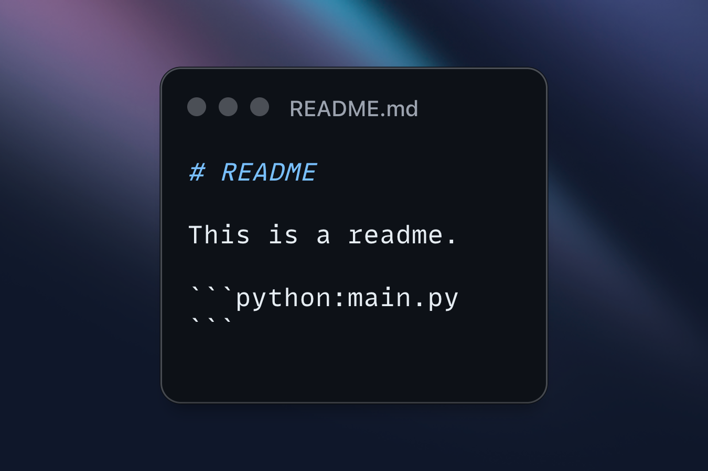
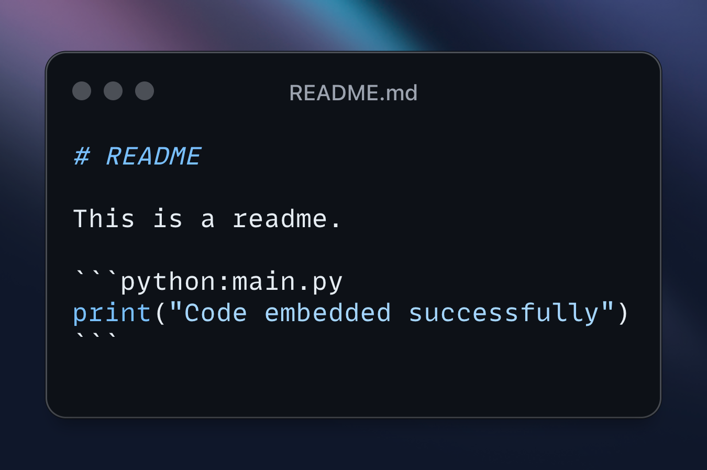
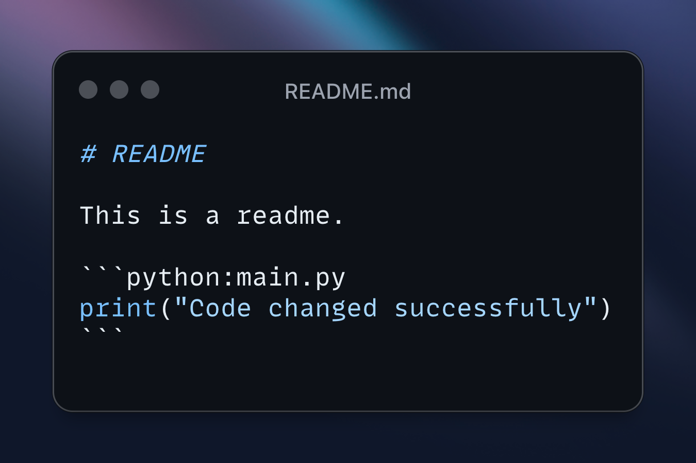

# code-embedder
<p align="center">
  
  
  
</p>

Code embedder is a GitHub action that updates your README.md with up-to-date code snippets from your scripts.

## Description
This action:
1. reads a README file from `readme_path` input,
1. looks for specific script tags in the README,
1. reads the content of the script and embeds it in the README at the corresponding tag,
1. pushes the changes to the repository.

## Workflow file structure
To use this action, you need to configure a yaml workflow file in `.github/workflows` folder (e.g. `.github/workflows/code-embedder.yaml`) with the following content:

```yaml:.github/workflows/code-embedder.yml
name: Code Embedder

on: pull_request

jobs:
  code_embedder:
    name: "Code embedder"
    runs-on: ubuntu-latest
    steps:
      - name: Checkout
        uses: actions/checkout@v3
        with:
          ref: ${{ github.event.pull_request.head.ref }}

      - name: Run code embedder
        uses: kvankova/code-embedder@0.0.1
        with:
          readme_path: README.md
        env:
          GITHUB_TOKEN: ${{ secrets.GITHUB_TOKEN }}

```
It requires a secret `GITHUB_TOKEN` with write and repo permission.

## README file configuration
You can specify which README file you want to update with `readme_path` (path to markdown). As of now,
it supports only one readme file, and if not specified, it will by default look for it in the root `README.md`.

The action looks for the following sections in the readme file based on which it will update the code snippets:
````
 ```language:path/to/script
 ```
````
These sections will be filled in by content of path/to/script and updated with up-to-date content of the scripts.

## Example

You will add the code block sections with path to the scripts in the following format:
````
# README

This is a readme.
```python:main.py
```
````
And once the worklow runs, the code block sections will be filled with the content of the script and updated in the readme file.

````
# README

This is a readme.
```python:main.py
print("Embedding successful")
```
````
Once the content of the script changes, the code block sections will be updated in the readme file.

# Areas for further improvement
- Refactoring of the code-embedder script
- Add possibility to specify multiple readme files
- Add possibility to paste only part of the script
- Add tests
