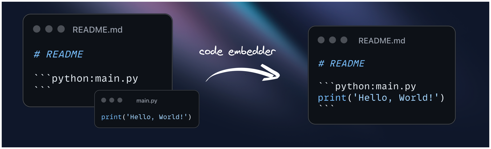

<div align="center">



## **Code Embedder**
Seamlessly update code snippets in your **README** files! 🔄📝🚀

[Description](#-description) • [How it works](#-how-it-works) • [Examples](#-examples) • [Setup](#-setup) • [Under the hood](#-under-the-hood)
</div>


## 📚 Description

**Code Embedder** is a GitHub Action that automatically updates code snippets in your markdown (`README`) files. It finds code blocks in your `README` that reference specific scripts, then replaces these blocks with the current content of those scripts. This keeps your documentation in sync with your code.

✨ **Key features**
- 🔄 **Automatic synchronization**: Keep your `README` code examples up-to-date without manual intervention.

- 🛠️ **Easy setup**: Simply add the action to your GitHub workflow and format your `README` code blocks.

- 📝 **Section support**: Update specific sections of the script in the `README`.

- 🧩 **Object support**: Update specific objects (functions, classes) in the `README`. *The latest version supports only 🐍 Python objects (other languages to be added soon).*


By using **Code Embedder**, you can focus on writing and updating your actual code 💻, while letting the action take care of keeping your documentation current 📚🔄. This reduces the risk of outdated or incorrect code examples in your project documentation.

## 🔍 How it works

The action looks for specific tags in all markdown (`README`) files, which indicate the script file path (and optionally the section to update), then it updates the code block sections in the `README` files with the content. The changes are then pushed to the repository 🚀.

### 📄 **Full script** updates
In the `README` (or other markdown) file, the full script is marked with the following tag:
````md
 ```language:path/to/script
 ```
````
### 📂 **Section** updates
In the `README` (or other markdown) file, the section of the script is marked with the following tag:
````md
 ```language:path/to/script:section_name
 ```
````
You must also add the following comment tags in the script file `path/to/script`, where the section is located:
```
[Comment sign] code_embedder:section_name start
...
[Comment sign] code_embedder:section_name end
```
The comment sign is the one that is used in the script file, e.g. `#` for Python, or `//` for JavaScript. The `section_name` must be unique in the file, otherwise the action will use the first section found.

### 🧩 **Object** updates
In the `README` (or other markdown) file, the object of the script is marked with the following tag:
````md
 ```language:path/to/script:object_name
 ```
````

> [!Note]
> The object name must match exactly the name of the object (function, class) in the script file. Currently, only 🐍 Python objects are supported.

> [!Note]
> If there is a section with the same name as any object, the object definition will be used in the README instead of the section. To avoid this, use unique names for sections and objects!


## 💡 Examples

### 📄 Full script update

Let's say you have the following `README` file:
````md
# README

This is a readme.

```python:main.py
```
````
The `main.py` file contains the following code:
```python
print("Embedding successful")
```

Once the workflow runs, the code block sections are filled with the content of the script located at `main.py` and updated in the `README` file.

````md
# README

This is a readme.

```python:main.py
print("Embedding successful")
```
````
With any changes to `main.py`, the code block section is updated in the `README` file with the next workflow run.

### 📂 Section update

Now we have the following `README` file:
````md
# README

This is a readme.

```python:main.py:A
```
````
The `main.py` file contains the following code:
```python
print("Hello, world!")

# code_embedder:A start
print("Embedding successful")
# code_embedder:A end
```

Once the workflow runs, the code block section will be updated in the `README` file with the content of the section `A` from the script located at `main.py` and pushed to the repository 🚀.

````md
# README

This is a readme.

```python:main.py:A
print("Embedding successful")
```
````

With any changes to the section `A` in `main.py`, the code block section is updated in the `README` file with the next workflow run.

### 🧩 Object update
The tag used for object update follows the same convention as the tag for section update, but you provide `object_name` instead of `section_name`, i.e. ` ```language:path/to/script:object_name`. The object name can be a function name or a class name.

For example, let's say we have the following `README` file:
````md
# README

This is a readme.

Function `print_hello` is defined as follows:
```python:main.py:print_hello
```

Class `Person` is defined as follows:
```python:main.py:Person
```
````

The `main.py` file contains the following code:
```python
...
def print_hello():
    print("Hello, world!")
...

class Person:
    def __init__(self, name):
        self.name = name
    def say_hello(self):
        print(f"Hello, {self.name}!")
...
```

Once the workflow runs, the code block section will be updated in the `README` file with the content of the function `print_hello` and class `Person` from the script located at `main.py` and pushed to the repository 🚀.

````md
# README

This is a readme.

Function `print_hello` is defined as follows:
```python:main.py:print_hello
def print_hello():
    print("Hello, world!")
```

Class `Person` is defined as follows:
```python:main.py:Person
class Person:
    def __init__(self, name):
        self.name = name
    def say_hello(self):
        print(f"Hello, {self.name}!")
```
````

With any changes to the function `print_hello` or class `Person` in `main.py`, the code block sections are updated in the `README` file with the next workflow run.

## 🔧 Setup
To use this action, you need to configure a yaml workflow file in `.github/workflows` folder (e.g. `.github/workflows/code-embedder.yaml`) with the following content:

```yaml
name: Code Embedder

on: pull_request

permissions:
  contents: write

jobs:
  code_embedder:
    name: "Code embedder"
    runs-on: ubuntu-latest
    steps:
      - name: Checkout
        uses: actions/checkout@v3

      - name: Run code embedder
        uses: kvankova/code-embedder@v0.4.0
        env:
          GITHUB_TOKEN: ${{ secrets.GITHUB_TOKEN }}

```

## 🔬 Under the hood
This action performs the following steps:
1. 🔎 Scans through the markdown (`README`) files to identify referenced script files (full script, section or 🐍 Python object).
1. 📝 Extracts the contents from those script files and updates the corresponding code blocks in the markdown (`README`) files.
1. 🚀 Commits and pushes the updated documentation back to the repository.
